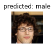

# manwomanclassification
resnet18 transferlearning 남자여자판별기
> CelebA 데이터 사용

## Features
- `torchvision.models` Resnet18 pretrained 사용  
- [Female(0), Male(1)] 클래스로 분류하는 fully connected layer 추가 `model.fc = nn.Linear(in_features=512, out_features=2, bias=True)`  
- 참고: https://pytorch.org/tutorials/beginner/transfer_learning_tutorial.html

## Set up
- environment
```
  Python 3.9.7
  
  torch==1.10.2
  torchvision==0.11.3
  argparse==1.1
  numpy==1.20.3
  pandas==1.3.4
  matplotlib==3.2.2
  PIL==8.4.0
```

## Preparing Dataset
```
  dataset/<br>
      └── [class1]<br>
        └── train
          ├── [[class 1] train image file 1]
          ├── [[class 1] train image file 2]
          ├── [[class 1] train image file 3]
          └── ...
        └── val
          ├── [[class 1] test image file 1]
          ├── [[class 1] test image file 2]
          ├── [[class 1] test image file 3]
          └── ...
      ├── [class2]<br>
        └── train
          ├── [[class 2] train image file 1]
          ├── [[class 2] train image file 2]
          ├── [[class 2] train image file 3]
          └── ...
        └── val
          ├── [[class 2] test image file 1]
          ├── [[class 2] test image file 2]
          ├── [[class 2] test image file 3]
          └── ...
```
> If the command line parameter `--prepared` is set, it means you are already prepared your dataset to train like the structure above.
> In default, you can prepare dataset automatically. But you must have below things.
- image data  
- csv file containing `image id` and `[attribute]` columns  
: csv file contains annotations. `image id` is filename of image. `[attribute]` is attribute name which you want to classify. It must be contained in columns of csv file. The value of attribute must be 1 or -1. The data of label -1 will classify as 0, and the data of label 1 will classify 1.  
- number of images per class  

## Usage
### Train
- args description
```
    --epochs            : default=100 
    --lr                : default=1e-4
    --batch_size        : defalut=32  
    --dset_root         : path of directory which includes celeb images (*.jpg)
    --csv_root          : annotation csv file path (list_attr_celeba.csv)  
    --ngpu              : number of gpu to use, -1 is for cpu
    --num_workers       : default=4
    --split_ratio_train : ratio of train dataset, default=0.8 

    --batch-size        : default=4
    --data-dir          : default='./dataset/'
    --data-csv          : default='list_attr_celeba.csv'
    --data-attr         : default='Male'
    --classes_name      : default=['female', 'male']
    --data-size         : default=1000
    --prepared          : Is the dataset prepared?
    --crop-size         : default=224
    --resize-size       : default=256
    --num-workers       : default=4
    --mean              : default=[0.485, 0.456, 0.406]
    --std               : default=[0.229, 0.224, 0.225]
    --checkpoint        : path of save model file to restore from.
    --save-dir          : default='./checkpoints/'
    --save-every        : default=5
    --num-epochs        : default=25
    --learning-rate     : default=0.001
    --momentum          : default=0.9
    --step-size         : default=7
    --gamma             : default0.1
    --test-data-ratio   : default=0.2
```
- usage
```
    python train.py --data-dir [dataset directory] --data-csv [csv file]
```
### Test
- args description
```
    --batch-size        : default=4
    --data-dir          : default='./dataset/'
    --data-csv          : default='list_attr_celeba.csv'
    --data-attr         : default='Male'
    --classes_name      : default=['female', 'male']
    --data-size         : default=1000
    --prepared          : Is the dataset prepared?
    --crop-size         : default=224
    --resize-size       : default=256
    --num-workers       : default=4
    --mean              : default=[0.485, 0.456, 0.406]
    --std               : default=[0.229, 0.224, 0.225]
    --checkpoint        : path of save model file to restore from.
    --visualize-imgs    : default=6
    --test-data-ratio   : default=1
```
- usage
```
    python test.py --prepared --checkpoint [checkpoint file]
```
## Results
  

